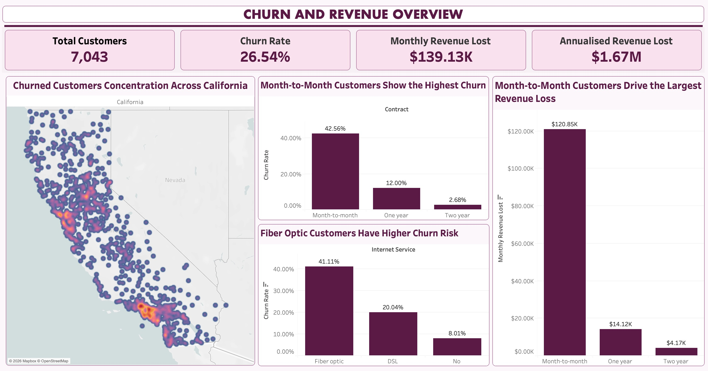
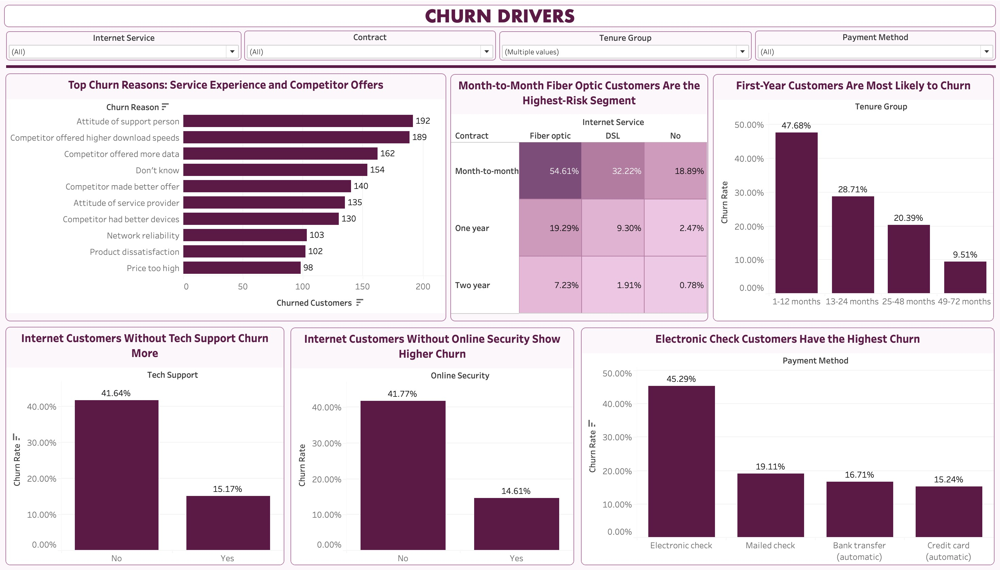
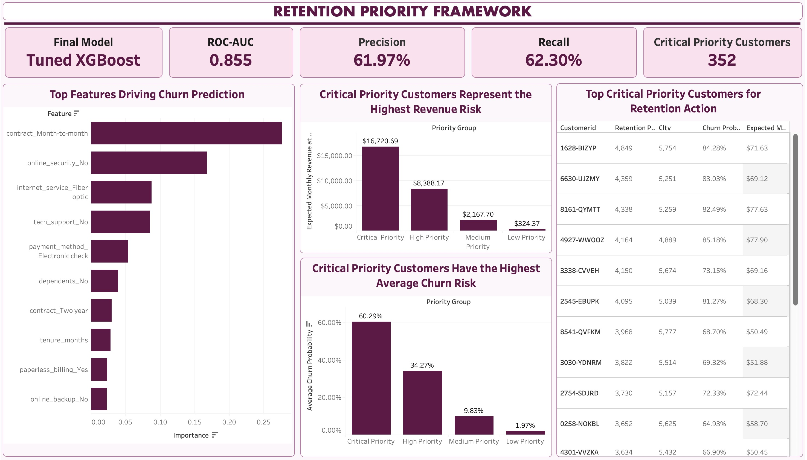

# Telecom Retention Analytics: Churn Prediction and Revenue-Risk Prioritisation

## Overview

This project is an end-to-end customer churn analytics solution for a fictional telecom company, using the IBM Telco Customer Churn dataset. The goal is to identify customers who are likely to churn, understand the key drivers behind churn, estimate revenue at risk, and create a retention priority framework for targeted customer retention.

The project combines SQL-based business analysis, Python-based exploratory data analysis, machine learning, customer-level retention scoring, and a Tableau dashboard to move beyond prediction and support practical business decision-making.

---

## Business Problem

Customer churn directly affects recurring revenue for telecom companies. The business needs to understand which customers are leaving, why they are leaving, and which customers should be prioritised for retention actions.

This project answers the following questions:

* Which customer segments have the highest churn rates?
* What contract, service, billing, and demographic factors are associated with churn?
* Can machine learning predict customers likely to churn?
* How much monthly revenue is at risk?
* Which customers should be prioritised for retention campaigns?

---

## Dashboard Preview

A three-page Tableau dashboard was created to communicate the project findings in a business-friendly format. The dashboard covers churn overview, churn drivers, revenue impact, model performance, and customer-level retention prioritisation.

### Churn and Revenue Overview



### Churn Drivers



### Retention Priority Framework



---

## Tools Used

* Python
* SQL / SQLite
* Pandas
* NumPy
* Matplotlib
* Seaborn
* Scikit-learn (Logistic Regression, Random Forest, Gradient Boosting)
* XGBoost
* Jupyter Notebook
* VS Code
* Tableau

---

## Dataset

The project uses the **IBM Telco Customer Churn dataset**, which contains customer-level information for a fictional telecom company.

Dataset summary:

* **Rows:** 7,043 customers
* **Columns:** 33 variables
* **Target variable:** `Churn_Value`
* **Churned customers:** 1,869
* **Retained customers:** 5,174
* **Overall churn rate:** 26.54%

The dataset includes customer demographics, service subscriptions, contract details, billing information, monthly charges, total charges, customer lifetime value, churn reason, and location information.

---

## Project Methodology

The project was completed in two main notebooks.

### Notebook 1: EDA, SQL and Business Analysis

The first notebook focused on understanding the business problem and identifying churn patterns.

Key steps included:

1. Loading and cleaning the dataset
2. Handling missing values and data quality issues
3. Creating a cleaned processed dataset
4. Running SQL queries for business analysis
5. Analysing churn by contract type, payment method, internet service, tenure, support services, and city
6. Estimating monthly and annualised revenue lost due to churn
7. Creating visualisations and business insights

### Notebook 2: Modelling and Retention Strategy

The second notebook focused on predictive modelling and business prioritisation.

Key steps included:

1. Preventing data leakage
2. Splitting the data into training and test sets
3. Building preprocessing pipelines
4. Training and comparing multiple classification models
5. Performing hyperparameter tuning
6. Performing threshold tuning
7. Selecting the final model
8. Generating customer-level churn probabilities
9. Creating a retention priority framework using churn probability and customer value

---

## Key Business Insights

The SQL and exploratory analysis revealed several important churn patterns:

* The overall churn rate is **26.54%**.
* Customers on **month-to-month contracts** have the highest churn rate at **42.71%**.
* Customers paying by **electronic check** have the highest churn rate by payment method at **45.29%**.
* **Fiber optic** customers have a churn rate of **41.89%** and account for the largest monthly revenue loss.
* Customers in their first 12 months have the highest churn rate at **47.68%**.
* Customers without **tech support** or **online security** are much more likely to churn.
* Churned customers account for approximately **USD 139,131** in lost monthly recurring revenue, equivalent to around **USD 1.67 million annually**.

These findings suggest that churn is strongly linked to contract flexibility, service type, billing behaviour, tenure, and support coverage.

---

## Machine Learning Models

The following models were trained and compared:

* Logistic Regression
* Random Forest
* Gradient Boosting
* XGBoost
* Tuned Random Forest
* Tuned Gradient Boosting
* Tuned XGBoost

The models were evaluated using:

* Accuracy
* Precision
* Recall
* F1-score
* ROC-AUC
* Confusion matrix

---

## Final Model Performance

The final selected model was **Tuned XGBoost** with an adjusted classification threshold of **0.45**.

| Metric    | Score |
| --------- | ----: |
| Accuracy  | 0.798 |
| Precision | 0.620 |
| Recall    | 0.623 |
| F1 Score  | 0.621 |
| ROC-AUC   | 0.855 |

The threshold was adjusted from 0.50 to 0.45 to achieve a better balance between precision and recall. This helps the business identify a meaningful share of churned customers while controlling unnecessary retention spending.

---

## Feature Importance

The most important features in the final model were:

| Feature                         | Importance |
| ------------------------------- | ---------: |
| Contract_Month-to-month         |      0.275 |
| Online_Security_No              |      0.168 |
| Internet_Service_Fiber optic    |      0.087 |
| Tech_Support_No                 |      0.085 |
| Payment_Method_Electronic check |      0.053 |
| Dependents_No                   |      0.040 |
| Contract_Two year               |      0.030 |
| Tenure_Months                   |      0.029 |
| Paperless_Billing_Yes           |      0.023 |
| Online_Backup_No                |      0.023 |

The feature importance results align closely with the SQL analysis. The model confirms that churn risk is strongly associated with month-to-month contracts, lack of support services, fiber optic internet, electronic check payments, and shorter tenure.

---

## Customer-Level Churn Scoring

The final model was used to generate churn probability scores for individual customers. These scores allow customers to be ranked by churn risk instead of only being classified as churn or no churn.

The highest-risk customers commonly shared the following profile:

* Short tenure
* Month-to-month contract
* Fiber optic internet
* Electronic check payment method
* No tech support
* No online security
* Relatively high monthly charges

This customer-level scoring makes the model more useful for targeted retention campaigns.

---

## Retention Priority Framework

A retention priority framework was created by combining churn probability with customer value.

### Expected Monthly Revenue at Risk

```text
Expected Monthly Revenue at Risk = Churn Probability × Monthly Charges
```

### Retention Priority Score

```text
Retention Priority Score = Churn Probability × CLTV
```

Customers were grouped into four priority categories:

* Low Priority
* Medium Priority
* High Priority
* Critical Priority

---

## Priority Segment Summary

| Priority Group    | Customers | Avg Churn Probability | Avg Monthly Charge | Avg CLTV | Expected Monthly Revenue at Risk | Expected Annual Revenue at Risk |
| ----------------- | --------: | --------------------: | -----------------: | -------: | -------------------------------: | ------------------------------: |
| Low Priority      |       353 |                 0.020 |              46.46 |  4530.56 |                           324.37 |                        3,892.46 |
| Medium Priority   |       352 |                 0.098 |              63.46 |  4451.65 |                         2,167.70 |                       26,012.37 |
| High Priority     |       352 |                 0.343 |              68.73 |  3987.69 |                         8,388.17 |                      100,658.07 |
| Critical Priority |       352 |                 0.603 |              77.75 |  4570.01 |                        16,720.69 |                      200,648.25 |

The **Critical Priority** group has the highest churn risk and the highest expected monthly revenue at risk. This group should be prioritised for proactive retention campaigns.

---

## Business Recommendations

Based on the analysis and modelling results, the following actions are recommended:

1. **Prioritise Critical Priority customers**
   These customers have the highest combination of churn probability and customer value.

2. **Encourage longer-term contracts**
   Month-to-month contracts were the strongest churn predictor. The company should offer incentives to move customers to one-year or two-year contracts.

3. **Improve support coverage**
   Customers without tech support or online security are more likely to churn. Bundled support or security offers could help improve retention.

4. **Investigate fiber optic customer experience**
   Fiber optic customers show high churn and high revenue loss. The company should investigate whether this is driven by price, reliability, service expectations, or competitor offers.

5. **Review electronic check customers**
   Customers paying by electronic check show high churn. The company could encourage automatic payment methods through convenience messaging or incentives.

6. **Focus on first-year customers**
   Early-tenure customers are at the highest churn risk. Improved onboarding and proactive check-ins could reduce churn during the first year.

---

## Project Structure

```text
Telecom Retention Analytics/
│
├── data/
│   ├── raw/
│   │   ├── Telco_customer_churn.xlsx
|   |   └── Telco_customer_churn.csv
│   └── processed/
│       ├── Telco_customer_churn.csv
│       ├── telco_churn.db
│       ├── contract_churn_summary.csv
│       ├── internet_churn_summary.csv
│       ├── payment_churn_summary.csv
│       ├── tenure_churn_summary.csv
│       ├── top_churn_reasons.csv
│       ├── final_xgboost_feature_importance.csv
│       ├── customer_churn_probability_scores.csv
│       ├── customer_retention_priority_scores.csv
│       └── retention_priority_summary.csv
│
├── notebooks/
│   ├── eda_sql_business_analysis.ipynb
│   └── modeling_retention_strategy.ipynb
│
├── sql/
│   └── churn_analysis_queries.sql
│
├── dashboard/
├── README.md
└── requirements.txt
```

---

## How to Run the Project

1. Clone the repository.

```bash
git clone <repository-url>
```

2. Install the required dependencies.

```bash
pip install -r requirements.txt
```

3. Place the raw dataset in the following folder:

```text
data/raw/Telco_customer_churn.xlsx
```

4. Run the notebooks in order:

```text
notebooks/eda_sql_business_analysis.ipynb
notebooks/modeling_retention_strategy.ipynb
```

---

## Key Outcomes

* Analysed **7,043 telecom customer records**
* Identified an overall churn rate of **26.54%**
* Used SQL to identify high-risk churn segments and revenue loss patterns
* Built and compared multiple machine learning models
* Selected **Tuned XGBoost** as the final model
* Achieved ROC-AUC of **0.855**
* Tuned the classification threshold to improve business usability
* Generated customer-level churn probability scores
* Created a retention priority framework using churn probability and CLTV
* Identified the Critical Priority group with approximately **USD 16,721 expected monthly revenue at risk**

---

## Future Improvements

Possible future improvements include:

* Building a Power BI or Tableau dashboard
* Deploying the model as a Streamlit app
* Adding SHAP values for deeper model explainability
* Simulating retention campaign costs and expected savings
* Building separate models for different customer segments
* Automating monthly churn scoring for new customer data

---

## Author

**Alankar Singh**
| MSc Data Science @ University of Exeter
